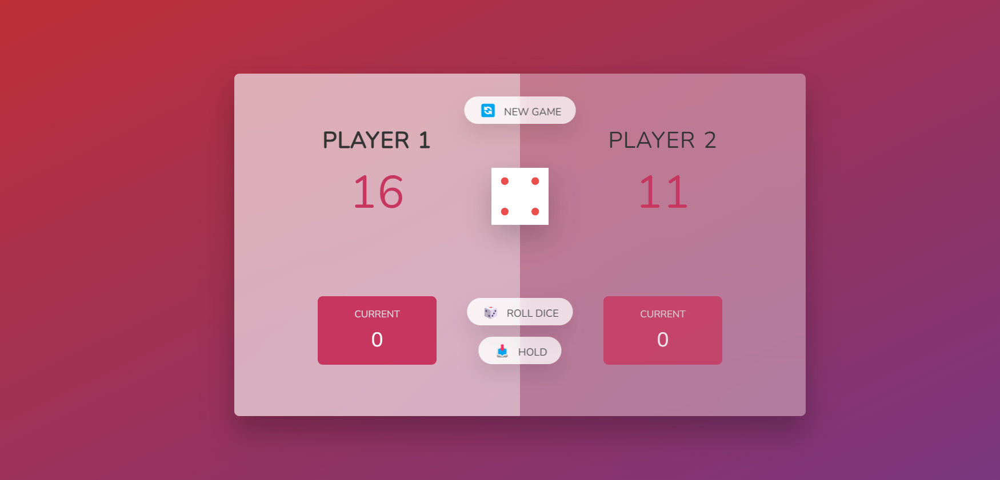

# Pig Game

## Table of contents

- [Overview](#overview)
  - [Rules](#Game-Rules)
  - [Screenshot](#screenshot)
  - [Links](#links)
- [My process](#my-process)
- [Built with](#built-with)
- [What I learned](#what-i-learned)
- [Continued development](#continued-development)
- [Useful resources](#useful-resources)
- [Author](#author)
- [Acknowledgments](#acknowledgments)

## Overview 
Hello everyone! I'm more than excited to share my first mini project with javascript! 😄 It's a little game called Pig Gmae. It is made with HTML,CSS & JS! 

### Game Rules
- If the dice is 1 then the player gets switched
- Player must hit hold button to reserve their score
- The first player who gets to 100 will win the game!

### Links

- [Solution URL](https://github.com/HosseinHeydarpour/results-summary-component)
- [Live Site URL](https://hosseinheydarpour.github.io/results-summary-component)

## My process
This project allowed me to harness the power of JavaScript and its DOM manipulation capabilities to create an engaging game. I employed techniques like querySelector, event listeners, and the DRY principle, which significantly enhanced my understanding of JavaScript.

### Built with
- Semantic HTML5 markup
- CSS
- JavaScript

### What I learned
In this mini project i really focused on my JS skills and tried to undrestand and learn new thing in JS

### Continued development
I still want to improve and enhace my abilities JS.

## Author

- Linkedin - [@hosseinheydarpour](www.linkedin.com/in/hosseinheydarpour)

